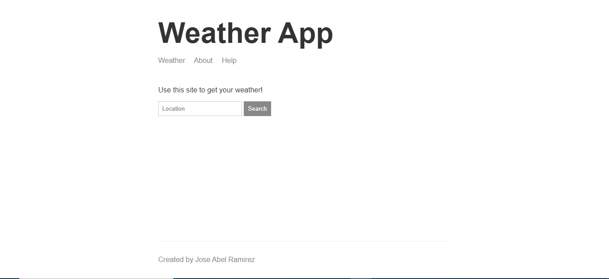

# Weather website

An API that display the weather information of any city in the world by typing the name of the city in the input form, build with NodeJS runtime engine and various JavaScript libraries, following the guide in the Udemy course "The Complete Node.js Developer Course (3rd Edition)" created by Andrew Mead and Rob Percival.

## Built With
- Javascript
- NodeJS
- The following libraries:
- express
- handlebars
- hbs
- kind-of
- minimist
- request
- require

## Authors
### Author1
- 👤GitHub: [Jose Abel Ramirez](https://github.com/jose-Abel)

## Getting Started
You can clone this code anytime and since it was build with NodeJS it's require the installation of the npm modules listed in the package.json in the dependencies section.

## Live version
https://ramirez-weather-application.herokuapp.com

### Setup
You can either copy the code with git clone or just do a git pull on your local environment. In order to run this web app locally you have to do "npm install" so npm can install all libraries included in the package.json file and then run "npm run start".

### Acknowledgments
Appreciate the teams at Udemy and the creators of the course Andrew Mead and Rob Percival since allows me to learn a lot of NodeJS concepts and design principles that is pushing my software development career higher.

## 📝 License
This project is MIT licensed.

## Show your support
Give a ⭐️ if you like this project!